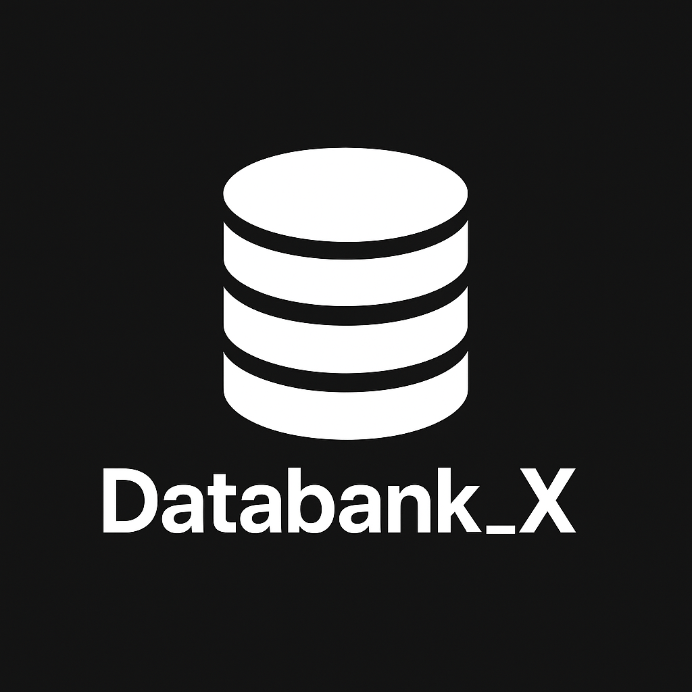

#  Databank_X

**A minimalistic, extensible database and encryption toolkit for Python**  
_Developed by [Micro (Micro444)](https://github.com/Micro444)_

---

## Table of Contents

- [Overview](#overview)
- [Installation](#installation)
- [Quick Start](#quick-start)
- [Basic Functions (`basic`)](#basic-functions-basic)
- [JSON File Management (`saves`)](#json-file-management-saves)
- [Encryption & Security (`security`)](#encryption--security-security)
- [API Reference](#api-reference)
- [License](#license)

---

## Overview

**Databank_X** is a small Python library for managing dictionary-based data, with functions for saving/loading as JSON as well as file encryption using Fernet (symmetric encryption).  
Ideal for small projects, learning purposes, or rapid prototypes.

---

## Installation

```bash
pip install cryptography
```
Place `Databank_X.py` and your logo (`logo.png`) in the project directory.

---

## Quick Start

```python
from Databank_X import basic, saves, security

basic.basic_List()
print(basic.show_List())
```

---

## Basic Functions (`basic`)

Jump directly to:  
[JSON File Management](#json-file-management-saves) | [Encryption](#encryption--security-security) | [API Reference](#api-reference)

### Commands and Brief Description

- [`basic.basic_List()`](#basicbasic_list)  
  **Initializes** the data structure with sample data.

- [`basic.show_List()`](#basicshow_list)  
  **Returns** the current data inventory.

- [`basic.add_data(datas, directory)`](#basicadd_data)  
  **Adds** an entry `datas` to the directory `directory`.

- [`basic.add_directory(name)`](#basicadd_directory)  
  **Creates** a new (empty) directory with name `name`.

- [`basic.remove_directory(name)`](#basicremove_directory)  
  **Deletes** the directory `name` and all contained data.

- [`basic.remove_data(directory, datass)`](#basicremove_data)  
  **Removes** the entry at position `datass` from `directory`.

- [`basic.index_searche(directory, indexes)`](#basicindex_searche)  
  Returns **the value** at position `indexes` in `directory` (or `"error"`).

- [`basic.string_data(datas, directory)`](#basicstring_data)  
  **Converts** a string into a list of characters and adds them to the directory.

---

## JSON File Management (`saves`)

- [`saves.save_json(file)`](#savessave_json)  
  Saves the current data as **JSON** to the file `file`.

- [`saves.see_json(file)`](#savessee_json)  
  **Loads** data from the JSON file `file` and returns it.

- [`saves.overwrite_data_json(file)`](#savesoverwrite_data_json)  
  **Overwrites** the current data with the data from `file`.

---

## Encryption & Security (`security`)

- [`security.decrypt(files)`](#securitydecrypt)  
  **Encrypts** the specified file with a Fernet key (key is stored in `keys.txt`).

- [`security.entcrypt(filess, keys)`](#securityentcrypt)  
  **Decrypts** the file with the key stored in `keys.txt`.

---

## API Reference

### <a name="basicbasic_list"></a>`basic.basic_List()`
Initializes the global dictionary with default values.

### <a name="basicshow_list"></a>`basic.show_List()`
Returns the current state of the data dictionary.

### <a name="basicadd_data"></a>`basic.add_data(datas, directory)`
Adds `datas` to the list in directory `data[directory]`.

### <a name="basicadd_directory"></a>`basic.add_directory(name)`
Creates a new empty directory `data[name]`.

### <a name="basicremove_directory"></a>`basic.remove_directory(name)`
Deletes the directory and its data.

### <a name="basicremove_data"></a>`basic.remove_data(directory, datass)`
Removes the value at index `datass` from `data[directory]`.

### <a name="basicindex_searche"></a>`basic.index_searche(directory, indexes)`
Returns the value at index `indexes` in `data[directory]` or `"error"`.

### <a name="basicstring_data"></a>`basic.string_data(datas, directory)`
Converts the string `datas` into a list and adds it to `data[directory]`.

---

### <a name="savessave_json"></a>`saves.save_json(file)`
Saves the data dictionary as JSON.

### <a name="savessee_json"></a>`saves.see_json(file)`
Loads and returns JSON data from `file`.

### <a name="savesoverwrite_data_json"></a>`saves.overwrite_data_json(file)`
Loads data from file and overwrites the global data.

---

### <a name="securitydecrypt"></a>`security.decrypt(files)`
Encrypts the file with Fernet, stores the key in `keys.txt`, and overwrites the file with the encrypted data.

### <a name="securityentcrypt"></a>`security.entcrypt(filess, keys)`
Reads the Fernet key from `keys.txt` and decrypts the file.

---

## License

### Databank_X – License (Custom Attribution License)

Copyright (c) 2025 [Mika (Micro444)]

The use of this code is permitted under the following conditions:

1. **Use and Modification**
   - The code may be freely used, modified, and integrated into your own projects.

2. **Distribution**
   - Copies or derivative works may be distributed as long as this license text is included.

3. **Attribution**
   - The original author ([Mika (Micro444)]) **must be credited** when this code or parts of it are used or published.

4. **No False Attribution**
   - It is **not permitted** to claim the original code or derivative works as independently or self-created without crediting the original author.

5. **Commercial Use**
   - Commercial use is permitted as long as points 3 and 4 are observed.

---

This is a free license with attribution requirement.  
If you use this code, please reference the original author.

---

**Author:** Mika ([Micro444](https://github.com/Micro444))

**Tip:**  
See [Fernet Documentation](https://cryptography.io/en/latest/fernet/) for encryption details.
